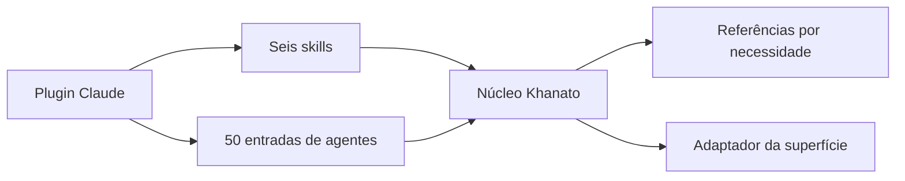

# Mapa do Khanato para Claude

Atualização com Cartographer e seu adaptador canônico: comparação por conteúdo e SHA-256 na adaptação original; neste repositório, o Git identifica o estado publicado. O mapa do Codex orientou a leitura incremental dos auxiliares inalterados; as entradas legadas, cartões correspondentes, rotas e adaptadores foram examinados na adaptação. Não é um runtime, serviço ou monitor.

## Entradas e fluxo

`../../../.claude-plugin/plugin.json` identifica o plugin 2.0.0. [SKILL.md](../SKILL.md) carrega regras comuns e encaminha às referências por necessidade. As outras cinco skills consultam este núcleo. Os 50 arquivos de `../../../agents/` preservam IDs e `model: inherit`; encaminham à Constituição, abertura do domínio e cartão específico, sem delegação obrigatória ou quantidade fixa de desenvolvedores.

## Navegação e autoridade

- [Constituição](../references/00-CONSTITUICAO-ESTRUTURA-FLUXOS.md): PostgreSQL, 5FN, identificadores, UUID v4, evidência e limites. Competências 01–07 e expansão 10 preservam os cartões do Codex; 11 define fronteiras.
- [Missões e memória](../references/08-MISSOES-MEMORIA.md): contrato, passagem, correção de premissas e Obsidian. Código define comportamento; mapa orienta navegação; cofre preserva decisões e histórico. Nenhuma cópia de conversas nem sincronização é criada.
- [Cartographer](../references/12-CARTOGRAPHER-CLAUDE.md), [Hermes](../references/16-HERMES-NO-CLAUDE.md) e [ambiente Claude](../references/17-AMBIENTE-CLAUDE.md): adaptação das ferramentas, contexto, isolamento, caminhos, recorrência e disponibilidade real.
- [UX](../references/13-REPERTORIO-UX.md), [segurança de aplicações](../references/14-SEGURANCA-APLICACOES.md) e [formatos Obsidian](../references/15-FORMATOS-OBSIDIAN.md) continuam carregados por gatilho; instruções não implantam controles nas aplicações.
- `constituicao.md`, `empresas.md` e `organograma.md` são redirecionamentos de compatibilidade. [source-parity.json](source-parity.json) registra a correspondência e a situação de cada arquivo em relação ao núcleo de origem.

## Auxiliares e avaliação

- [create_eval_workspace.py](../scripts/create_eval_workspace.py): prepara entradas sintéticas em destino novo, valida caminhos e inicializa Git apenas quando requerido pelo caso; usa ambiente Git isolado por processo e não executa agentes.
- [validate_eval_results.py](../scripts/validate_eval_results.py): valida contrato, estados, critérios, revisão e hashes de evidências; não pontua comportamento. Evidência desatualizada ou critério parcial impede aprovação.
- [test_validate_eval_results.py](../scripts/test_validate_eval_results.py): 16 testes dos contratos e preparação, inclusive caminhos inseguros, configuração Git externa e evidência alterada. Todos usam biblioteca padrão; requerem Python e Git para os casos Git.
- [cases.json](../evals/cases.json): 18 casos sintéticos; apenas a versão da suíte e o nome da superfície no pedido Hermes foram adaptados. [results-template.json](../evals/results-template.json): 36 rodadas `not_run`. [Procedimento de avaliação](../references/09-AVALIACAO-KHANATO.md) separa execução, pontuação e validação.

| Código preservado do Codex | SHA-256 |
|---|---|
| `scripts/create_eval_workspace.py` | `37b5ad2668c408be60c5940d1fcdcc6894d0ad4316a8a1d25d13ea1fefbf0961` |
| `scripts/test_validate_eval_results.py` | `b7b57c440d556fe736fd6b4351c0ca50fc4c2e3f0b84d3ff536d64587cbf2ec2` |
| `scripts/validate_eval_results.py` | `61f56ee09a3c9eb2587a51fc3af60ee017fe91d4bb62228794794ca31573f9c0` |

## Manutenção e limites

As instruções comuns foram comparadas com o baseline do núcleo de origem; a situação de cada arquivo está em `source-parity.json` e as diferenças de ambiente concentram-se nos adaptadores 12, 16 e 17. A revisão de campos/caminhos e os testes dos auxiliares não demonstram carregamento, execução ou paridade comportamental no Claude. Resultados efetivos pertencem às evidências da entrega, fora do template e do contexto obrigatório.

Para atualizar, confronte versão do núcleo, conteúdo dos arquivos e contratos da superfície; preserve adaptações pertinentes. Verifique mudanças em arquivos existentes e novos, sem considerar igualdade de nomes/datas suficiente. Não fixe caminhos de cache no pacote nem modifique credenciais/settings ao publicar uma nova versão. Quando houver cofre adotado, registre a entrega no Obsidian conforme a política, ou declare incorporação pendente quando o cofre não estiver acessível.
