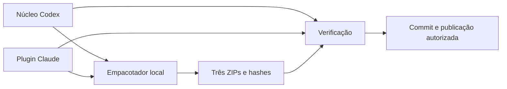

# Mapa do repositório (Khanato, edição pública)

Raiz independente, sem importar repositórios ou dados das empresas. Mapeamento pelo Cartographer com adaptador Khanato: inventário seletivo, comparação com as duas fontes, leitura dos novos auxiliares e revisão independente do conteúdo para distribuição. Estado e história passam a ser identificados pelos commits deste repositório.

## Estrutura

| Caminho | Função |
|---|---|
| [codex/skills/khanato](../codex/skills/khanato/SKILL.md) | Skill Codex e recursos independentes; metadados em agents/openai.yaml. |
| [claude](../claude/README.md) | Plugin Claude, seis skills, 50 agentes e seu manifesto. |
| [.claude-plugin/marketplace.json](../.claude-plugin/marketplace.json) | Catálogo para instalação do plugin em ./claude; não é o próprio plugin. |
| [versions.json](../versions.json) | Revisões declaradas das edições e do conjunto distribuído. |
| [scripts/build_packages.py](../scripts/build_packages.py) | Gera três ZIPs determinísticos, manifest e hashes exclusivamente das fontes locais versionadas. |
| [scripts/verify.py](../scripts/verify.py) | Confere metadados, núcleo comum, rotas, testes dos auxiliares e igualdade ZIP/fonte. Não usa rede nem modelos. |
| packages/ | Artefatos instaláveis versionados, regenerados quando suas fontes mudam. |
| [LICENSE](../LICENSE) | Termos de uso e redistribuição desta edição. |
| .local/ | Evidências transitórias desta máquina; ignoradas pelo Git e sem papel na instalação. |

## Fluxo

Os mapas específicos permanecem junto de cada skill. O empacotador rejeita links/junções e arquivos inesperados nas distribuições; os arquivos de avaliação .env são exemplos sintéticos dentro de JSON. O verificador confronta onze referências comuns e três auxiliares entre edições, executa seus testes e, com --packages, lê cada ZIP e compara seu conteúdo com a fonte. Não instala nem autentica aplicativos.

## Limites e atualização

O repositório guarda instruções e auxiliares. Cofre, credenciais, conversas e dados de projetos mantêm suas autoridades e destinos próprios. [Manutenção](MAINTENANCE.md) define publicação e recuperação; [validação](VALIDATION.md) registra o que foi executado nesta entrega. Não há testes de comportamento no runtime Claude nesta publicação.

Preserve os limites de cada edição, fonte e pacote; reexecute controles pertinentes depois de mudanças. Atualize este mapa para alterações em estrutura, interfaces ou fluxo e considere mudanças locais ainda não commitadas. Não reescreva evidências históricas para parecer que foram executadas no estado atual.
